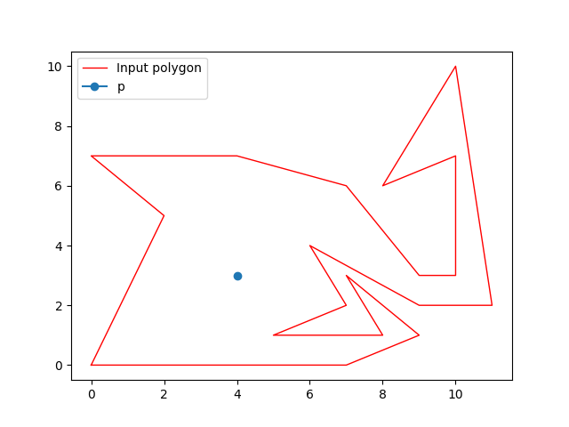
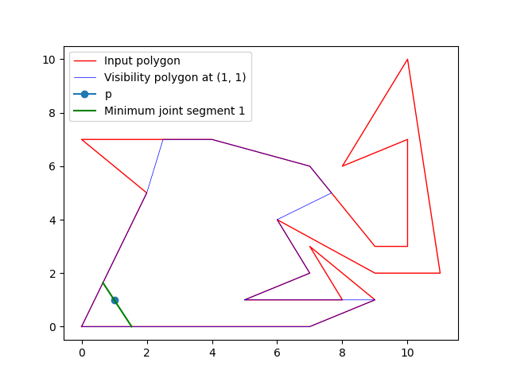

# Width crack computation
## About this project
In this project, we implement a program to compute the width of crack in a given 2D crack image. The process include two steps:
- Extract the crack contour from the image. We use **YOLO-v8** model to extract the contour.
- Compute the width of the crack following the definition in [AnHaiWidthCompactSet2022](https://imacs.hcmut.edu.vn/prePrint/637656eabc980f2641531285_IMACS-2022-01-crack-width-20221119.pdf).

    
    

    
<strong>Figure 1:</strong> (a) Input image. (b) Computing width of the crack in the image.

### Compute width at a point
The main contribution in this project is implement an algorithm for computing width of crack at a point $p$, given it polygon representation of contour. We build a linear-time algorithm which following those steps:
- Construct [Visibility polygon](https://en.wikipedia.org/wiki/Visibility_polygon) at point $p$. We implement a linear-time program for computing visibility polygon of simple polygon at a point (See `algorithms/visibility_polygon.py`).
- Compute width of **Visibility polygon** at point $p$ by linearly iterating through all edges, following the counterclockwise direction.

    
    

    
<strong>Figure 2:</strong> (a) Input polygon. (b) Computing width of polygon at a point p.

# How to run program 
## Download packages
To make sure the code run with compatible version of packages, you need to download packages from `requirement.txt` file using command: `pip install -r requirements.txt`.

## Run programs
### Main program
Main program will run from the scratch, from read the input image, extract the contour of image and sequentially compute width of polygon at points in the **skeleton**.

To run the program, use command `python main.py [img_name] [crack_index]`. Where `[img-name]` is the file name of input image that placed in `fig` directory.

    
    

    
<strong>Figure 2:</strong> (a) Input image at file <strong>crack_02.jpg</strong> (b) Result after running command <strong>python .\main.py crack_02.jpg 0</strong>.

To run your interested input, you can paste your own input image into directory `fig` and execute the above command to compute the width of crack in your image.

### Compute width at point
Also, we support programs that compute the width of polygon at a specific point. You can try them using either two commands:
- `python width_at_point.py [input_path]` where `[input_path]` is the file name to your input of polygon $\mathcal{P}$ and point $p$. See the sample input file in there.
- `python width_with_mouse_click.py [img_name] [crack_index]`: Similar to the mail file, where in this program, you can specify the coordinate of the point by clicking directly on the input image.

    
    
    

    
<strong>Figure 3:</strong>Computing width at specified points in <strong>width_with_mouse_click.py</strong>

