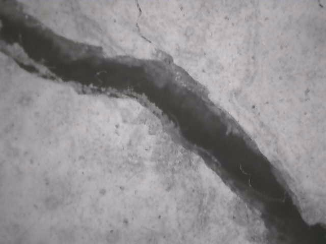
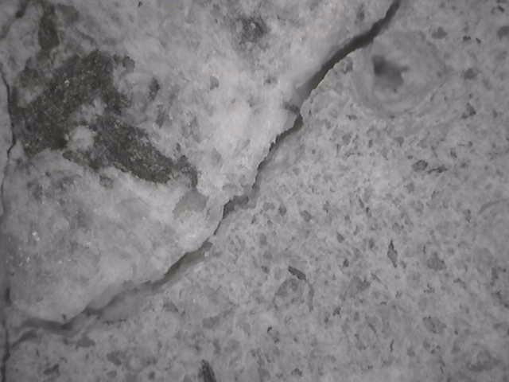
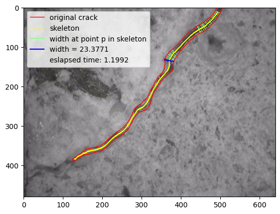

# Width Computation of Compact Sets in the Plane

### Authors

Nguyen Hoang Hai[1,3],  
Phan Thanh An[1,3,&#xf0e0;],  
Tran Quoc Trung[2,3],  
Tran Quoc Hieu[2,3]  

---

1 Institute of Mathematical and Computational Sciences, Ho Chi Minh City University of Technology (HCMUT), 268 Ly Thuong Kiet Street, District 10, Ho Chi Minh City, Vietnam  
2 Faculty of Computer Science and Engineering, Ho Chi Minh City University of Technology (HCMUT), 268 Ly Thuong Kiet Street, District 10, Ho Chi Minh City, Vietnam  
3 Vietnam National University Ho Chi Minh City, Linh Trung Ward, Thu Duc City, Ho Chi Minh City, Vietnam  
&#xf0e0; Corresponding author: thanhan@hcmut.edu.vn  

---

### Abstract

The width function for a compact subset \( S \subset \mathbb{R}^n \) at a point \( p \in S \), denoted by \( W(S; p) \), is defined as the infimum of the distances between two boundary points of \( S \) that contain \( p \). In this article, we prove that the width of the set \( S \) at \( p \) is equal to the width of its visibility set at \( p \). Additionally, we introduce a linear algorithm to compute \( W(S; p) \) for \( p \in S \), where \( S \) is a polygon in the plane. Finally, the algorithm is implemented in Python to compute the width of polygons, and some real-world applications, namely, measuring the widths of cracks on the surfaces of some solids, are given.

## Implementation
We implement a program to compute the width of polygons in the plane and to measure the width of cracks on the surfaces of some solids in construction (see Figure 1).

    
    

    
<strong>Figure 1:</strong> (a) Input image. (b) Computing width of the crack in the image.

# How to run program 
## Download packages
To make sure the code run with compatible version of packages, you need to download packages from requirement.txt file using command: pip install -r requirements.txt.

## Run programs
### Main program
Main program will run from the scratch, from read the input image, extract the contour of image and sequentially compute width of polygon at points in the **skeleton**.

To run the program, use command python main.py [img_name] [crack_index]. Where [img-name] is the file name of input image that placed in fig directory.

    
    

    
<strong>Figure 2:</strong> (a) Input image at file <strong>crack_02.jpg</strong> (b) Result after running command <strong>python .\main.py crack_02.jpg 0</strong>.

To run your interested input, you can paste your own input image into directory fig and execute the above command to compute the width of crack in your image.

### Compute width at point
Also, we support programs that compute the width of polygon at a specific point. You can try them using either two commands:
- python width_at_point.py [input_path] where [input_path] is the file name to your input of polygon $\mathcal{P}$ and point $p$. See the sample input file in there.
- python width_with_mouse_click.py [img_name] [crack_index]: Similar to the mail file, where in this program, you can specify the coordinate of the point by clicking directly on the input image.

    
    
    

    
<strong>Figure 3:</strong>Computing width at specified points in <strong>width_with_mouse_click.py</strong>

