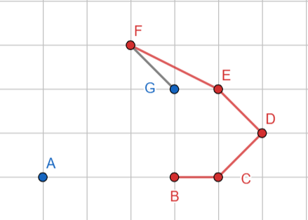

# Visibility of a simple polygon
## Stage 1: Find the starting point
- We find the initial point then adding to the `visibility_polygon`.
- **Strategy**: Find the nearest intersection by the Oy ray from the point p.
- We first add that nearest intersection to the `visibility_polygon`.
- We also reorder the input polygon so that the wise follow radian wise(from 0 to 2$\pi$), with the first point starting from the nearest intersection.

## Stage 2: Construct the visibility polygon
- We loop for all points in the polygon (of course, linearly).
- In each loop, we determine the control variables and follow the if-else structure based on those variables.
### 1. Control Variables
- `is_visible`: Indicate whether the considering edge is visible from the point `p` or not.
    + *We check by comparing that edge with the current `visibility_polygon`*.
    + *In case the considering edge is invisible, we can skip them*.
- `angle_diff`: Determine the wise of the considering edge (clockwise or counter-clockwise).

### 2. If-else case for each iterative
- Case 1: `is_visible` $=$ True
    - Case 1.1: `angle_diff` $< \pi$. Mean that the edge is counterclockwise.
      - We simply add the next vertex into `visibility_polygon`.
    - Case 1.2: `angle_diff` $> \pi$. Mean that the edge is clockwise.
      - Case 1.2.1: The edge is visible and override the current `visibility_polygon`.
        + We 
      

      
      
Figure: The case 1.2.1

      

      